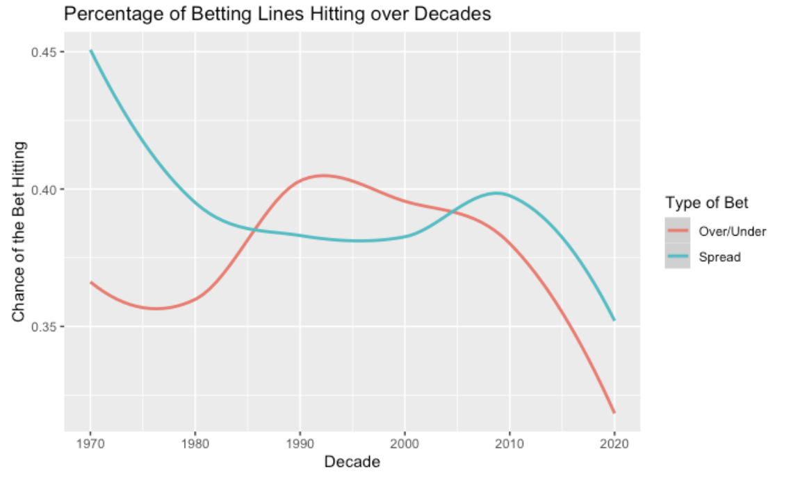

# Betting in the NFL - Project Summary
With the rise of sports betting becoming more accessible through electronic devices such as phones, the concept of sports betting has become a more popular form of gambling across the United States. People love to try to get money from sports, especially ones that interest them as they believe it is an easy way to make some money. The goal for our project, is to analyze betting lines placed on NFL games, and take corresponding game statistics, to find correlation/factors that show how book makers create these betting lines. From these insights we hope to be able to provide, NFL enthusiasts and individual who enjoy sports betting as a whole, a better strategy on to place bets on games, through the use of statistical analysis and data. Our aim is to answer the following questions:

- How often to favorites win based on the spread?
- How accurate are the over/under totals compared with the total score of the game?
- Effect of indoor/outdoor stadiums on over/under totals?
- Over/under lines through the decades. Have odds makers matched evolving offenses?
- Spreads favoring home team or away team?
- Underdogs win more at home/away?
- How often do the lines set by bookmakers hit? How have they changed over time, with the advent of technology?
  
The datasets, we utilized in this project, were taken from reputable sources, Kaggle and ProFootballReference. The Kaggle dataset contained information on the betting lines for NFL games, and additional external factors such as weather data. The dataset taken from ProFootballReference contained the data on respective NFl games, and was filled with offensive statistics, from both the winning and losing teams. These datasets were then both combined, to create our final dataset, which can be found [here](datasets/game_bets.csv). Using this dataset, we were able to successfully create correlations relating to betting lines and how NFL games played out. As a takeway, we learned that the best betting strategy that effectively maximizes the odds for your bets to hit, is to place bets on the over, for the over/under line, and take the underdog on the spread, as the chances that the favorite covers the spread, is quite low. 
